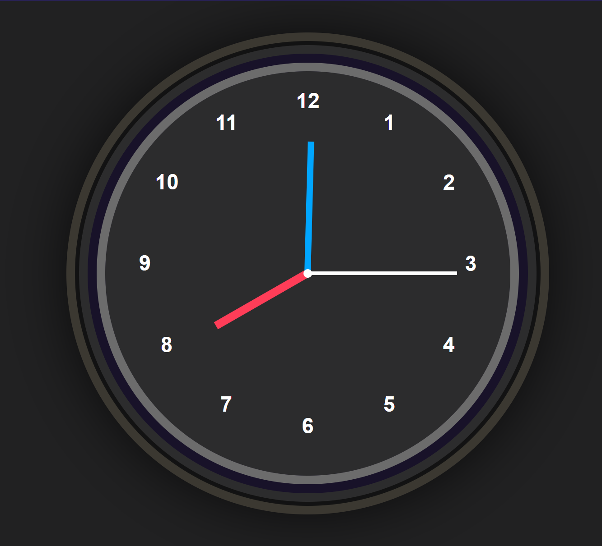

# Analog Clock

An elegant analog clock created using HTML, CSS, and JavaScript. This project serves as a visual representation of a working clock that dynamically updates in real-time.

## Demo

Check out the live demo of the project [here](https://sanskargupta0.github.io/Analog-Clock/).

## Features

- **Real-time Clock**: Displays current local time, updating continuously.
- **Analog Design**: A classic design with hour, minute, and second hands.
- **Responsive Layout**: Works on various screen sizes and devices.

## Preview



## Technologies Used

- **HTML**: Provides the basic structure of the clock.
- **CSS**: Used for styling the clock and positioning elements.
- **JavaScript**: Adds the logic for the movement of the hour, minute, and second hands in real time.

## Installation

1. Clone the repository to your local machine:

   ```bash
   git clone https://github.com/Sanskargupta0/Analog-Clock.git

2. Navigate to the project folder:

   ```bash
   cd Analog-Clock

3. Open index.html in your browser to view the clock.
